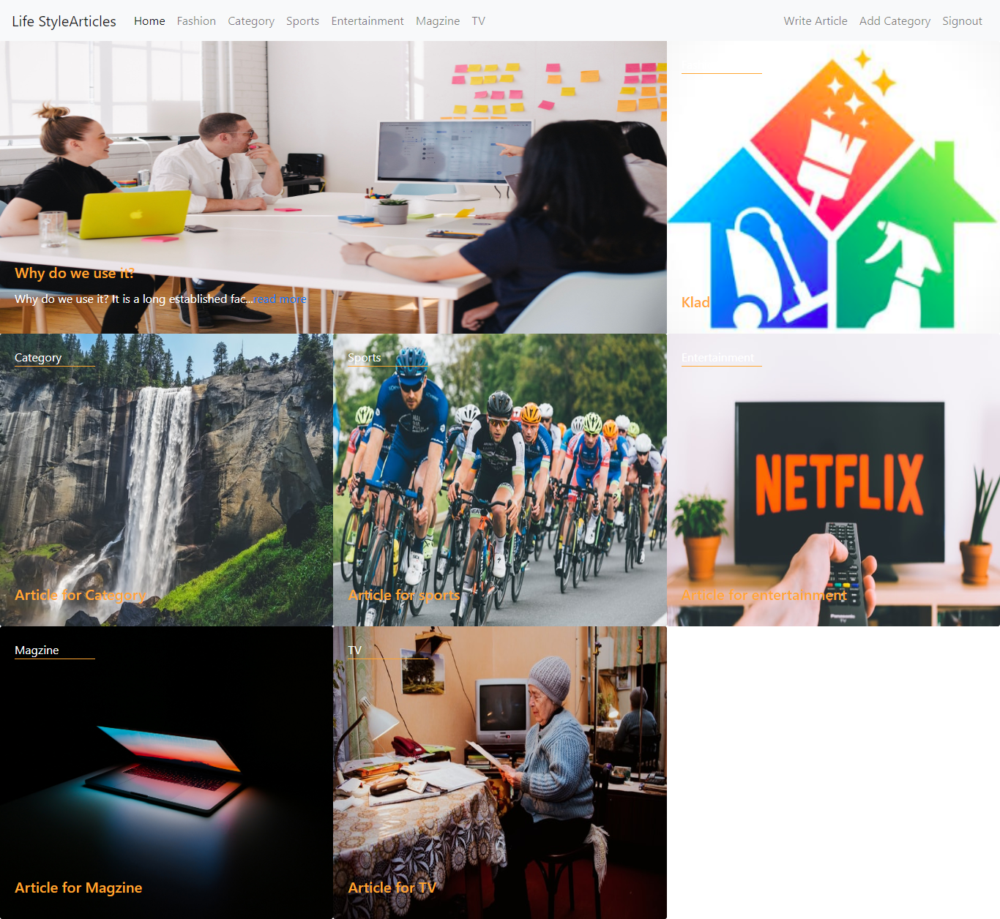
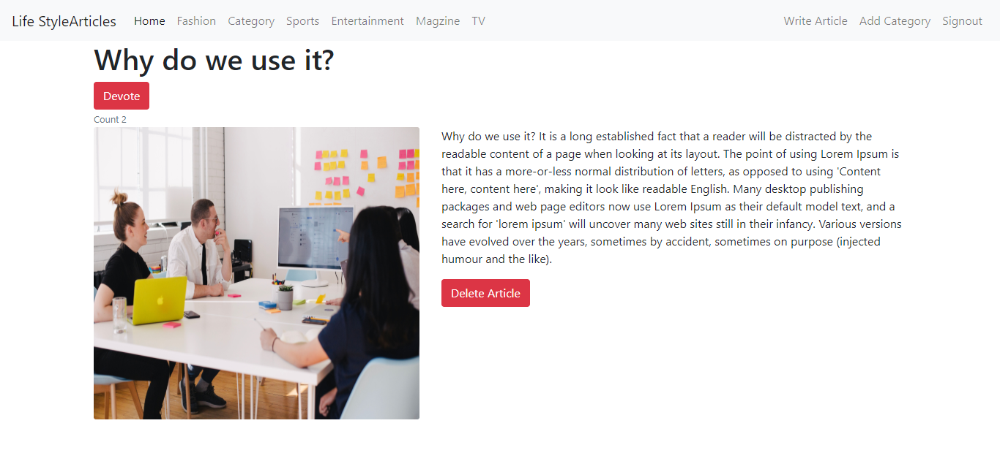

<h1 align="center">
Life Style Articles
</h1>
> LifeStyle Articles Project is built using the Ruby Rails framework. The project is about Blog posting for topics like fashion, entertainment, sports,.etc For Reader there are options to like/comment on posts.

## Built With

- Ruby v2.6.5
- Ruby on Rails v6.1.4
- Rspec
- Lucid Chart
## Screen Shots


## Live Demo

`https://calm-bastion-63762.herokuapp.com/`

## Getting Started

To get a local copy up and running follow these simple example steps.

### Prerequisites

Ruby: 2.6.3
Rails: 5.2.3
Postgres: >=9.5

### Setup

Instal gems with:

```
bundle install
```

Setup database with:

```
   rails db:create
   rails db:migrate
```

### Usage

Start server with:

```
    rails server
```

Open `http://localhost:3000/` in your browser.

Open `https://calm-bastion-63762.herokuapp.com/` in your browser.

### Run tests

```
    rpsec --format documentation
```

> Tests will be added by Microverse students. There are no tests for initial features in order to make sure that students write all tests from scratch.

### Deployment

`https://calm-bastion-63762.herokuapp.com/`

## Authors

Tashfeen Rao `https://github.com/TashfeenRao`
Ko Nyan `https://github.com/konyan`

## 🤝 Contributing

Contributions, issues and feature requests are welcome!

Feel free to check the [issues page](issues/).

## Show your support

Give a ⭐️ if you like this project!

## Acknowledgments

Microverse
Heroku

## 📝 License

MIT
